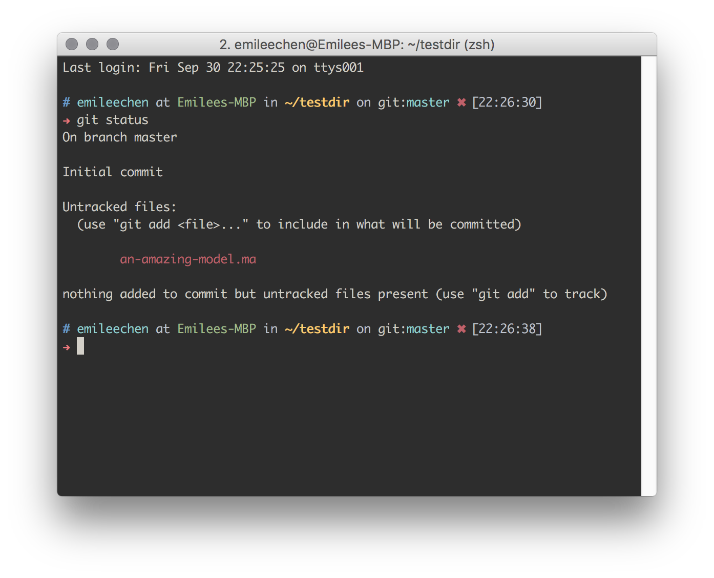
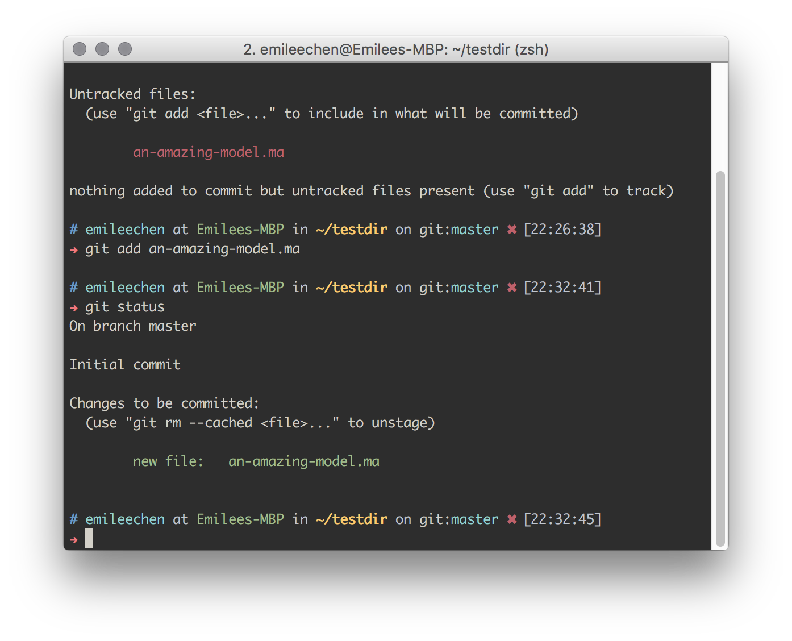
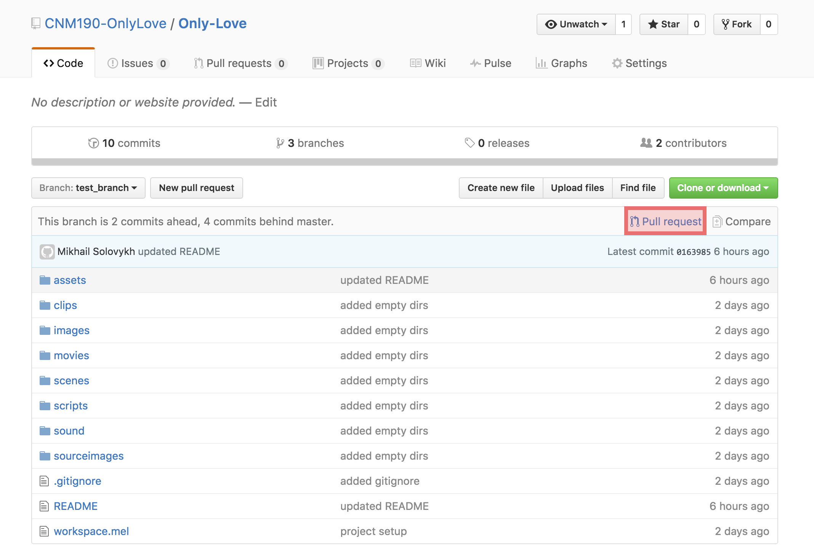
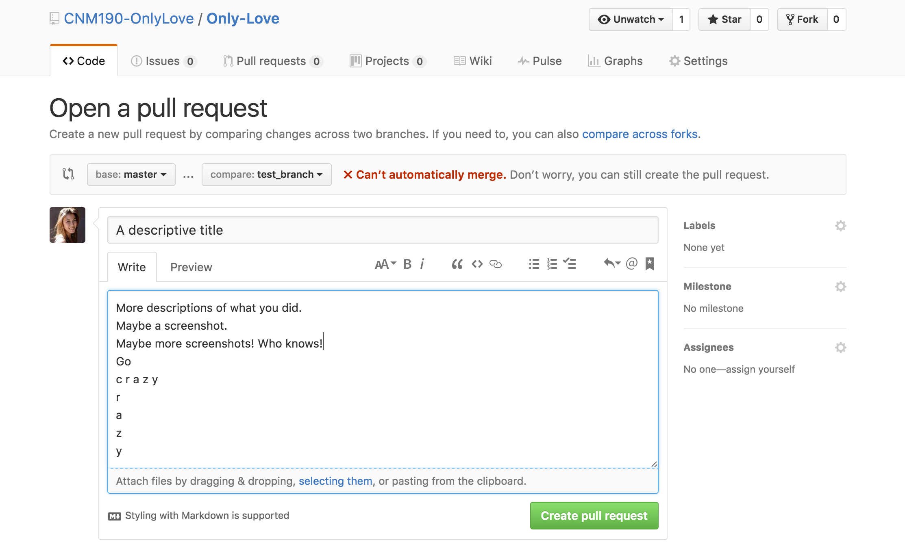

# The Only Love A Man's Ever Known

## Git Tutorial
Welcome to your one stop git tutorial!

### Getting Started (How to get the project from GitHub)

#### First, open up a terminal.
If you're on Windows, [download Git Bash](https://git-scm.com/downloads).
If you're on Mac/Linux, open up Terminal.

#### Navigating around your terminal.
First, some terminology: A directory is what you might call a folder.
`ls` - lists files in the curent directory
`cd <filename>` - change directory into filename

Use `ls` and `cd` to navigate to where you want the project to download to.

#### Grabbing the Only-Love folder from GitHub.
Type `git clone https://github.com/CNM190-OnlyLove/Only-Love.git` into your terminal.
Use `ls` to check if for the Only-Love folder.
You now have the latest version of all the assets!

### Let's start working on stuff!

#### Downloading the latest version.
Once you leave your laptop for a while and other busy people start making changes, the files on your computer will become outdated since git doesn't update files automatically.
That means, **you *must* pull from origin** before you try to work your magic on anything!

More terminology: A branch is a version of all our files.

1. `git checkout master`
  * This switches you to the master branch.
2. `git pull origin master`
  * This pulls the latest project version from github.com (origin) and merges it with your local branch (master).

#### Creating a branch.
1. `git checkout -n "<branchname>"`
  * This command creates a new branch named <branchname> and switches you to that branch. Anytime you start working on something new you need to create a branch for yourself. This allows you to do anything you want and not break the “real” master branch project. A branch is basically a version of the project just for you. You can blow everything up and corrupt all the files in this branch and we’re still not dead as a team because we still have the master branch which is the “perfect, everything works” branch. 
  * Replace <branchname> with whatever you want to call your branch. Please make it descriptive!
  * ex. `git checkout -n "ReggieModelHairUpdate"`

#### How to upload your work/branch.
1. `git status`
  * This will show you all the changes (new files and changed files) you have made.

2. `git add <filename>`
  * Add <filename> to the list of files that you want to show the world. Do this to all the files that you've changed.

3. `git commit -m "<comment>"`
  * Save all the files you added in step 2 into a commit with a comment. Please write a *descriptive* commit comment! "Reggie's Hair" doesn't mean much. "Reggie's hair is no longer backwards" means a lot more!
4. `git push origin <branchname>`
..* This uploads your branch to github.com (origin). If you go to [our GitHub page](https://github.com/CNM190-OnlyLove/Only-Love), you should see your branch when you click on the [branches tab](https://github.com/CNM190-OnlyLove/Only-Love/branches).
5. Click into your branch.
6. On the top right, there is a button that says 'Pull request'. Click it.

7. Create a good title and description of your pull request and click “Create Pull Request”. If your pull request is something visual, put some screenshots in the description!

8. You’re done! Now Veronica/Mike/Emilee will check out what you did, approve it, and merge it in. Or we’ll say “fix blah blah blah” in which case you can fix whatever, and repeat steps 1 through 4. The pull request will automatically update with your fixes and alert us that you made some changes.

### Misc commands

#### How to switch branches.
1. `git branch` to see all the branches available to you.
2. `git checkout <branchname>` to switch to the branch named <branchname>

#### How to revert to a previous save/commit.
1. `git log` to see all the commits
2. `git checkout 99e1cf36ad9a1ddb956a376f30839f85297f9bf2` the number is the number right next to the commit in the log. You’re now on a previous commit/save.
